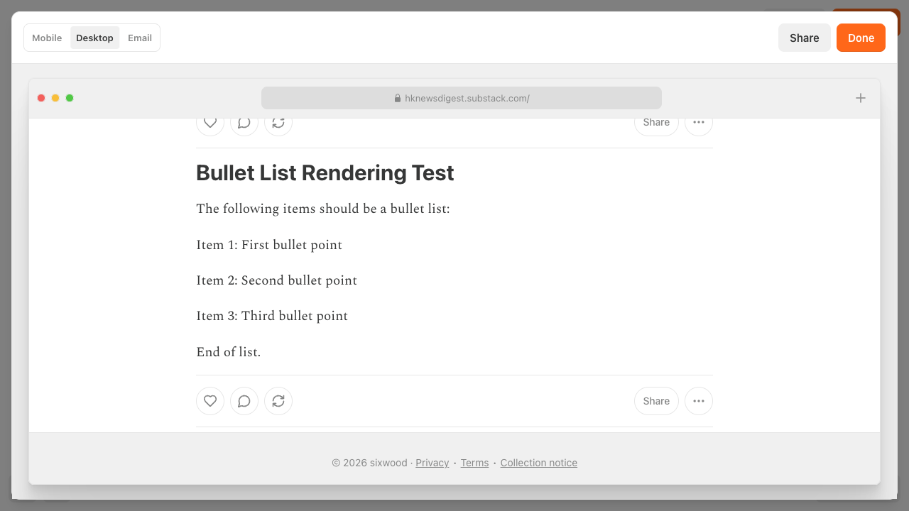
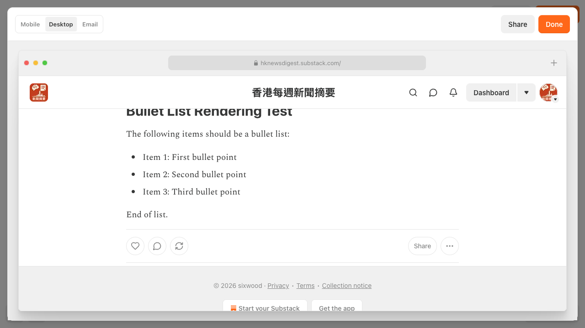

# Python Substack

Write Substack posts in Markdown and safely create, inspect, schedule, and
publish them through Python, a command-line interface, or MCP.

[](https://pypi.org/project/python-substack/)
[](https://pypi.org/project/python-substack/)
[](https://github.com/ma2za/python-substack/actions/workflows/ci.yml)
[](https://github.com/ma2za/python-substack/actions/workflows/ci_publish.yml)
[](LICENSE)
[](https://pepy.tech/project/python-substack)

[Documentation](https://ma2za.github.io/python-substack/) ·
[Getting started](https://ma2za.github.io/python-substack/getting-started.html) ·
[PyPI](https://pypi.org/project/python-substack/)

> [!IMPORTANT]
> Creating and publishing are separate operations. `substack drafts create`
> always creates an unpublished draft. It never schedules, sends, publishes,
> or deletes content.

## From Markdown to a Substack draft

Install the package:

```bash
pip install python-substack
```

Check the selected account and publication:

```bash
substack status
```

Create a safe unpublished draft, then publish only when it is ready:

```bash
substack drafts create post.md
substack drafts publish 12345 --no-send
```

Publishing and deletion require confirmation. Noninteractive and JSON
workflows must pass `--yes` explicitly.

Markdown source:



Substack result:



## What it supports

- Create rich Substack drafts from Markdown.
- Upload local images referenced by Markdown.
- Set audience, comment permissions, SEO metadata, slug, sections, and tags.
- List and inspect publications and drafts.
- Schedule, unschedule, publish, and delete drafts with explicit safeguards.
- Use stable JSON envelopes in scripts and automation.
- Authenticate with browser cookies or email and password.
- Use the same publishing workflow from Python or an optional MCP server.

## Setup

Copy `.env.example` to `.env` and configure one authentication method:

```env
EMAIL=
PASSWORD=
PUBLICATION_URL=
COOKIES_PATH=
COOKIES_STRING=
```

Cookie authentication is usually more reliable when Substack requires captcha
or magic-link sign-in. See
[Authentication](docs/authentication.md) for cookie export instructions and
account-selection details.

Verify the installation without authenticating:

```bash
substack --version
substack --help
```

## CLI

Create a draft with metadata:

```bash
substack --json drafts create post.md \
  --title "My Post" \
  --subtitle "Optional subtitle" \
  --tag python \
  --tag substack \
  --slug my-post \
  --search-engine-title "SEO title" \
  --search-engine-description "SEO description"
```

Inspect publications and drafts:

```bash
substack publications list
substack drafts list --limit 10
substack drafts get 12345
substack --publication-url https://example.substack.com drafts list
```

Manage scheduling:

```bash
substack drafts schedule 12345 --at 2026-08-01T09:00:00+03:00
substack drafts unschedule 12345
```

Publish or delete intentionally:

```bash
substack drafts publish 12345 --no-send
substack drafts delete 12345 --yes
```

Global options such as `--json`, `--cookies`, and `--publication-url` must
appear before the command:

```bash
substack --json drafts list
substack --cookies cookies.json --json status
```

The original standalone commands remain supported. See
[Legacy CLI commands](docs/legacy-cli.md).

## Python

```python
import os

from dotenv import load_dotenv
from substack import Api

load_dotenv()

api = Api(
    email=os.getenv("EMAIL"),
    password=os.getenv("PASSWORD"),
    publication_url=os.getenv("PUBLICATION_URL"),
)

result = api.create_draft_from_markdown(
    title="Shipping with Python",
    subtitle="A short note from a script",
    markdown="""
# Hello

This draft was created from **Markdown**.


""",
    tags=["python", "automation"],
    slug="shipping-with-python",
)

print(result["draft"]["id"])
```

`create_draft_from_markdown` creates a draft by default. It publishes only when
`publish=True` is passed.

For direct ProseMirror node construction, see the
[low-level Python API](docs/low-level-api.md). YAML workflows are documented in
[YAML drafts](docs/yaml.md).

## Markdown

Supported Markdown includes headings, paragraphs, bold, italic, inline code,
strikethrough, superscript, subscript, links, images, linked images, image
captions, code blocks, blockquotes, ordered and unordered lists, horizontal
rules, footnotes, LaTeX math, pull quotes, and callouts.

```python
from substack.post import Post

post = Post("Title", "Subtitle", user_id=1)
post.from_markdown(
    """
# Heading

Paragraph with **bold**, *italic*, `code`, and [links](https://example.com).
"""
)
```

Pass `api=` to upload local images while rendering:

```python
post.from_markdown(markdown_content, api=api)
```

See the complete [Markdown reference](docs/markdown.md).

## MCP

Install and run the optional MCP server:

```bash
pip install "python-substack[mcp]"
substack-mcp
```

The MCP tools use the same environment variables and SDK behavior as the CLI.
See [MCP server](docs/mcp.md) for the tool list and safety notes.

## Project documentation

- [Documentation site](https://ma2za.github.io/python-substack/)
- [Installation and first draft](docs/getting-started.md)
- [Unified CLI](docs/cli.md)
- [Python SDK](docs/python-sdk.md)
- [Authentication](docs/authentication.md)
- [Markdown reference](docs/markdown.md)
- [Legacy CLI commands](docs/legacy-cli.md)
- [Low-level Python API](docs/low-level-api.md)
- [YAML drafts](docs/yaml.md)
- [MCP server](docs/mcp.md)
- [Safety and publishing behavior](docs/safety.md)
- [Troubleshooting](docs/troubleshooting.md)
- [Compatibility policy](docs/compatibility.md)
- [Contributing](CONTRIBUTING.md)
- [Security policy](SECURITY.md)
- [Changelog](CHANGELOG.md)

## Compatibility

The project preserves existing Python APIs, console commands, CLI behavior,
environment variables, JSON keys, and MCP tool signatures through the 1.x
series. Additive capabilities may be introduced. See the
[compatibility policy](docs/compatibility.md).

## Disclaimer

This project is not affiliated with Substack. It uses undocumented Substack
interfaces that may change without notice.
